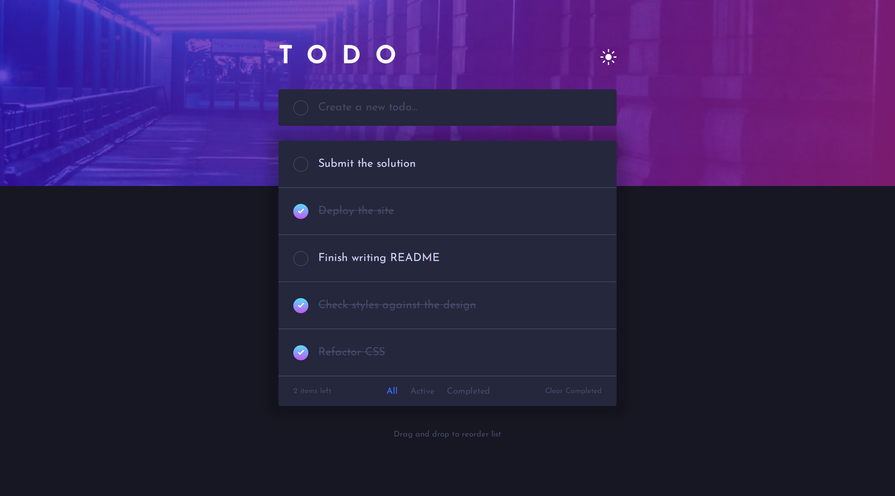

# Frontend Mentor - Todo app solution

This is a solution to the [Todo app challenge on Frontend Mentor](https://www.frontendmentor.io/challenges/todo-app-Su1_KokOW). Frontend Mentor challenges help you improve your coding skills by building realistic projects.

## Table of contents

-   [Overview](#overview)
    -   [The challenge](#the-challenge)
    -   [Screenshot](#screenshot)
    -   [Links](#links)
-   [My process](#my-process)
    -   [Built with](#built-with)
    -   [What I learned](#what-i-learned)
    -   [Continued development](#continued-development)
    -   [Useful resources](#useful-resources)
-   [Author](#author)

## Overview

### The challenge

Users should be able to:

-   View the optimal layout for the app depending on their device's screen size
-   See hover states for all interactive elements on the page
-   Add new todos to the list
-   Mark todos as complete
-   Delete todos from the list
-   Filter by all/active/complete todos
-   Clear all completed todos
-   Toggle light and dark mode
-   **Bonus**: Drag and drop to reorder items on the list

### Screenshot

### Links

-   [Solution URL](https://github.com/c0dehamster/todo-app)
-   [Live Site URL](https://todo-app-two-iota.vercel.app/)

## My process

### Built with

-   Semantic HTML5 markup
-   CSS custom properties
-   Flexbox
-   CSS Grid
-   Mobile-first workflow
-   [Svelte](https://svelte.dev/) - JS framework
-   Typescript
-   [svelte-dnd-action](https://github.com/isaacHagoel/svelte-dnd-action) - a library for creating drag and drop components for Svelte using a custom action

### What I learned

To complete this project, I learned about derived stores which were useful for displaying filtered lists of todos. I also attempted the bonus challenge to make the list sortable and got approximately halfway through. I learned about svelte-dnd-action library which seems to cover most use cases for drag-and-drop components. I expect it to be useful in later projects.

I used UUID package to generate IDs for tasks. This insures IDs are unique but is not really necessary as they don't have to be cryptographically secure.

Everything else in the challenge was mostly familiar to me. A lot of code is actually re-used from my previous projects with little to no alterations.

### Continued development

I cannot say I am fully satisfied with my result. While saving reordered todos and filtering tasks based on their completeness worked by themselves, I haven't found a way to use them together. The challenge does not specify how the full list should change when a filtered sub-list is reordered and I couldn't figure it out on my own.

### Useful resources

-   [Svelte docs about derived stores](https://svelte.dev/docs#run-time-svelte-store-derived)

-   [Drag and drop with Svelte using svelte-dnd-action](https://dev.to/isaachagoel/drag-and-drop-with-svelte-using-svelte-dnd-action-4554) - An article about making a drag-and-drop list with svelte-dnd-action written by the author of the library

-   [SvelteKit Drag And Drop List With svelte-dnd-action](https://www.youtube.com/watch?v=sFX525V3dMs) - This video was useful for figuring out how to use the library with typescript

## Author

-   Frontend Mentor - [@twDevNoob](https://www.frontendmentor.io/profile/twDevNoob)
